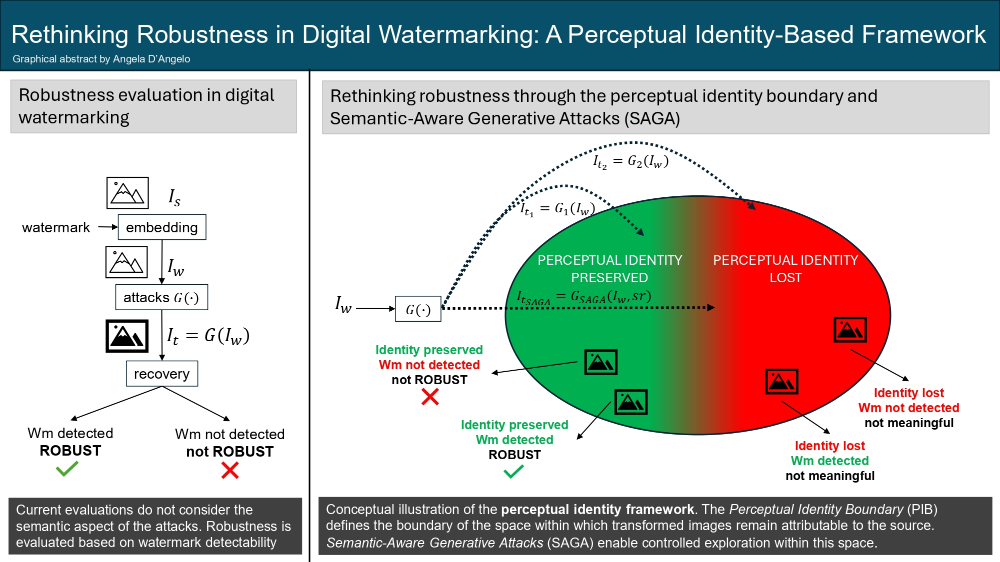
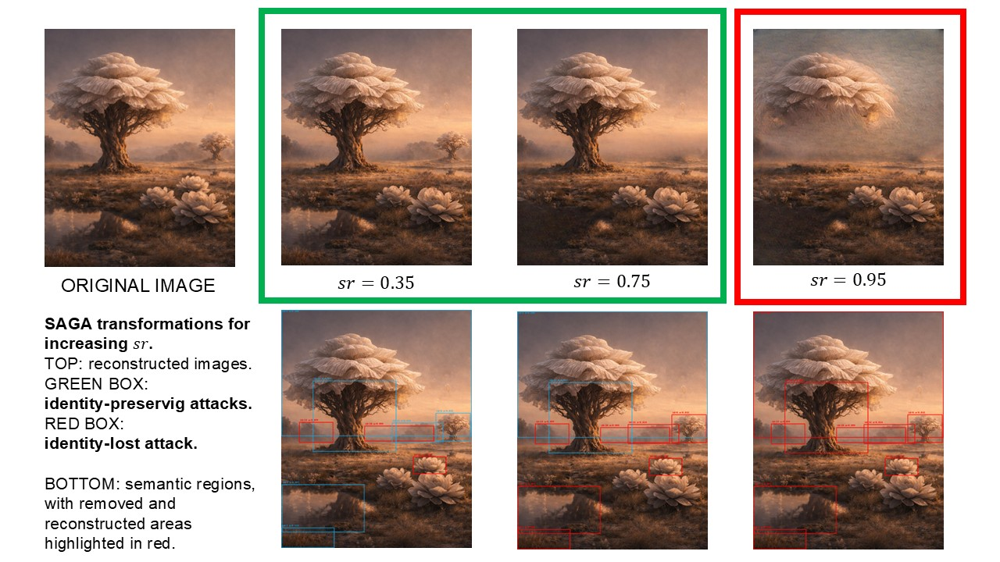

# Semantic-Attacks
This repository provides the implementation of SAGA, a framework for generating controlled, identity-preserving transformations that challenge digital watermarking systems. The code enables reproducible experiments on perceptual identity and supports research on robustness evaluation beyond distortion-based benchmarks.

# Semantic-Aware Generative Attacks (SAGA)

Official implementation of **Semantic-Aware Generative Attacks (SAGA)**.

> *"Rethinking Robustness in Digital Watermarking: A Perceptual Identity-Based Framework)*
> (submitted to IMAVIS 2026)
>


<p align="center">
  
</p>

Conceptual illustration of perceptual identity and identity-preserving attacks for watermark robustness.

---

## 📌 Overview

This repository provides a minimal and reproducible implementation of **SAGA**, a framework for generating **identity-preserving generative attacks** against digital watermarking systems.

Unlike traditional distortion-based attacks, SAGA:

* operates on **semantic regions**
* preserves **perceptual identity**
* progressively modifies image content
* challenges **watermark detectability in generative settings**

---

## 🧠 Key Idea

Modern generative editing can significantly transform images while preserving their perceptual identity.

This creates a mismatch between:

* watermark robustness
* similarity metrics
* human perception

To formalize this gap, we introduce Perceptual Identity (PI), which captures whether a transformed image is still perceived as the same visual entity, and the Perceptual Identity Boundary (PIB), which defines the limit beyond which this identity is no longer preserved.

**SAGA addresses this gap** by generating controlled transformations that:

* remain within the identity-preserving regime
* progressively remove semantic components
* enable systematic robustness evaluation

---

## ⚙️ Method

The attack pipeline consists of three stages:

1. **Region Extraction**

   * Automatic segmentation using **SAM2**
   * Produces candidate semantic regions

2. **Region Selection**

   * Regions are ranked based on:

     * area
     * centrality
     * foreground relevance
     * stability
   * A subset is selected using the **semantic removal ratio** ( sr \in [0,1] )

3. **Reconstruction**

   * Selected regions are removed
   * Missing content is reconstructed via **LaMa inpainting**

The attack is parameterized as:
[
I_t = G(I, sr)
]

<p align="center">
  
</p>

---

## 📁 Repository Structure

```bash
semantic-attacks/
│
├── src/
│   ├── semantic_attack.py   # Main pipeline (CLI + core logic)
│   └── requirements.txt
│
├── examples/               # Example input images
│
└── README.md
```

---

## 🚀 Installation

```bash
git clone https://github.com/your-username/semantic-attacks.git
cd semantic-attacks

python -m venv .venv
source .venv/bin/activate   # Windows: .venv\Scripts\activate

pip install -r src/requirements.txt
```

---

## ▶️ Usage

Run the attack:

```bash
python src/semantic_attack.py \
    --input examples/input/image.png \
    --output_dir examples/output \
    --sr 0.5
```

---

## ⚙️ Parameters

| Parameter           | Description                  |
| ------------------- | ---------------------------- |
| `--input`           | Input image                  |
| `--output_dir`      | Output directory             |
| `--sr`              | Semantic removal ratio (0–1) |
| `--mask_backend`    | `sam2` (default) or `dummy`  |
| `--inpaint_backend` | `lama` (default) or `dummy`  |
| `--sam2_cfg`        | Path to SAM2 config          |
| `--sam2_ckpt`       | Path to SAM2 checkpoint      |
| `--device`          | `cpu` or `cuda`              |

---

## 🔄 Backends

### Segmentation

* `sam2` → full semantic segmentation (recommended)
* `dummy` → synthetic masks (for testing)

### Inpainting

* `lama` → real inpainting (recommended)
* `dummy` → blurred fill (debug only)

---

## 📤 Outputs

For each run, the pipeline generates:

* attacked image
* union mask
* binary mask
* debug overlay (regions + selection)
* JSON metadata

All outputs are saved in the specified output directory.

---

## 📈 Applications

* Watermark robustness evaluation
* Generative attack benchmarking
* Perceptual identity analysis
* Research on identity-aware metrics

---


## 📜 Citation

```bibtex
@article{dangelo2026saga,
  title   = {Rethinking Robustness in Digital Watermarking: A Perceptual Identity-Based Framework},
  author  = {D'Angelo, Angela},
  journal = {IMAVIS},
  year    = {2026}
}
```

---

## 📬 Contact

Angela D’Angelo
[angela.dangelo@unimercatorum.it](mailto:angela.dangelo@unimercatorum.it)

