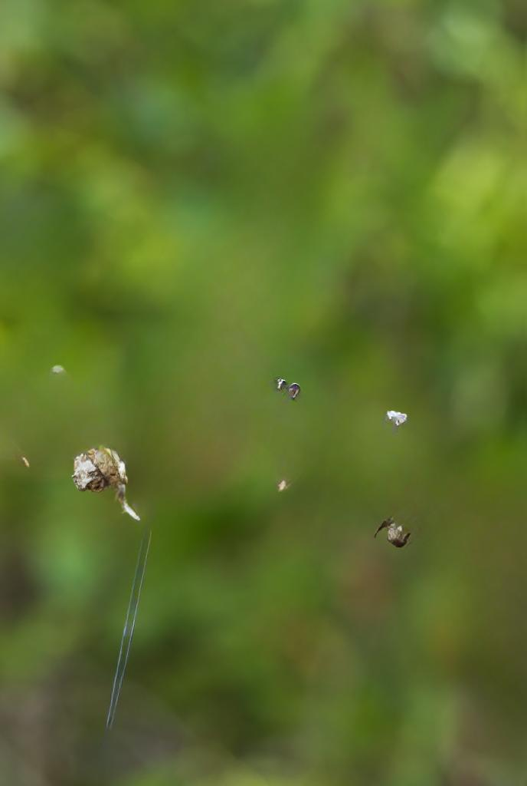

## SAGA Examples

<table align="center">
  <tr>
    <th>Original</th>
    <th>sr = 0.35 - C=small</th>
    <th>sr = 0.75 - C=small </th>
    <th>sr = 0.95 - C=small</th>
  </tr>
  <tr>
    <td></td>
    <td></td>
    <td></td>
    <td></td>
  </tr>
    <tr>
    <th>Original</th>
    <th>sr = 0.35 - C=large</th>
    <th>sr = 0.75 - C=large </th>
    <th>sr = 0.95 - C=large</th>
  </tr>
  <tr>
    <td></td>
    <td></td>
    <td></td>
    <td></td>
  </tr>
      <th>Original</th>
    <th>sr = 0.35 - C=small</th>
    <th>sr = 0.75 - C=small </th>
    <th>sr = 0.95 - C=small</th>
  </tr>
  <tr>
    <td></td>
    <td></td>
    <td></td>
    <td></td>
  </tr>
    <tr>
    <th>Original</th>
    <th>sr = 0.35 - C=large</th>
    <th>sr = 0.75 - C=large </th>
    <th>sr = 0.95 - C=large</th>
  </tr>
  <tr>
    <td></td>
    <td></td>
    <td></td>
    <td></td>
  </tr>
      <th>Original</th>
    <th>sr = 0.35 - C=small</th>
    <th>sr = 0.75 - C=small </th>
    <th>sr = 0.95 - C=small</th>
  </tr>
  <tr>
    <td></td>
    <td></td>
    <td></td>
    <td></td>
  </tr>
    <tr>
    <th>Original</th>
    <th>sr = 0.35 - C=large</th>
    <th>sr = 0.75 - C=large </th>
    <th>sr = 0.95 - C=large</th>
  </tr>
  <tr>
    <td></td>
    <td></td>
    <td></td>
    <td></td>
  </tr>
      <th>Original</th>
    <th>sr = 0.35 - C=small</th>
    <th>sr = 0.75 - C=small </th>
    <th>sr = 0.95 - C=small</th>
  </tr>
  <tr>
    <td></td>
    <td></td>
    <td></td>
    <td></td>
  </tr>
    <tr>
    <th>Original</th>
    <th>sr = 0.35 - C=large</th>
    <th>sr = 0.75 - C=large </th>
    <th>sr = 0.95 - C=large</th>
  </tr>
  <tr>
    <td></td>
    <td></td>
    <td></td>
    <td></td>
  </tr>
</table>
